## ↓ Images de l'avancement du projet plus bas ↓

# SpotiMate

**SpotiMate** est une application web de réseau social musical unique qui connecte les utilisateurs selon leurs goûts Spotify. Grâce à une intégration avec l’API Spotify et une interface React dynamique, SpotiMate propose un système de matching basé sur les préférences musicales et un chat en temps réel pour échanger.

---

## Fonctionnalités principales

- Authentification sécurisée via Spotify OAuth 2.0
- Analyse des goûts musicaux et création de profils utilisateurs
- Matching intelligent basé sur la similarité des playlists et morceaux préférés
- Messagerie instantanée en temps réel entre utilisateurs compatibles
- Interface utilisateur fluide et responsive avec React
- Possibilité de publier des posts sur un fil d'actualité

---

## Technologies utilisées

| Partie           | Technologies                          |
|------------------|------------------------------------|
| Frontend (client)| React, React Router, Axios          |
| Backend (serveur)| Node.js, Express, Spotify Web API  |
| Authentification | OAuth 2.0 via Spotify               |
| Base de données   | MongoDB      |

---

---

## Côté administratif

- **Équipe de développement :** Trois membres : Mathis Lefebvre, Thibault Lannuzel et Corentin Lucas
- **Gestion des branches Git :** Branche principale `main`, branche d’intégration `developp`, branches features pour chaque fonctionnalité
- **Phases de développement :**  
  - Mise en place de l’authentification Spotify ✔
  - Configuration page Profil ✔
  - Développement page Explorer ✔
  - Développement du système de matching ✔
  - Implémentation du chat en temps réel ✔
  - Tests et déploiement (à chaque changement)
  - Développement du frontend (en parallèle) ✔
- **Réunions :** Hebdomadaires, tous les lundis à 18h00  
- **Code review :** Pull requests obligatoires avant fusion dans `developp` puis `main`

## Avancement du projet en images

### Login Page :
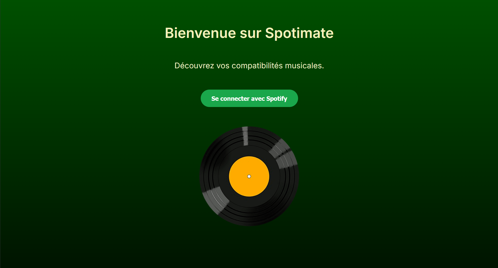

### Profil User :
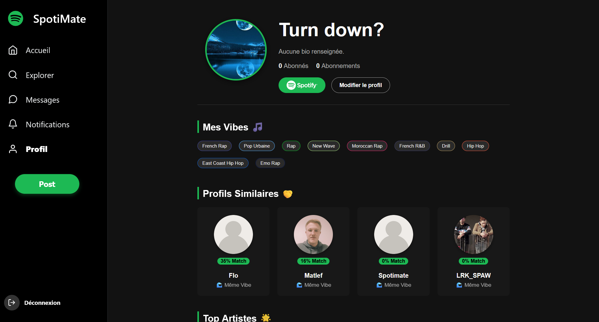

### Page Feed :
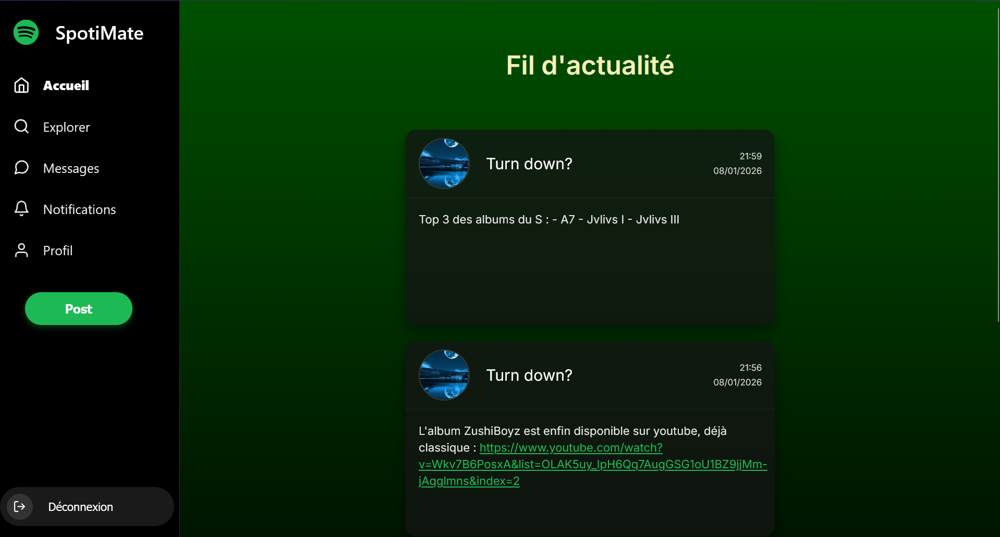
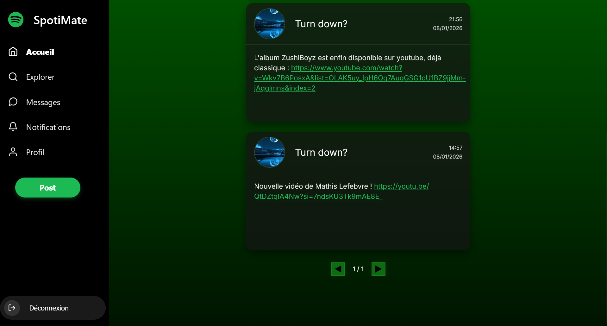

### Page Créer un post :
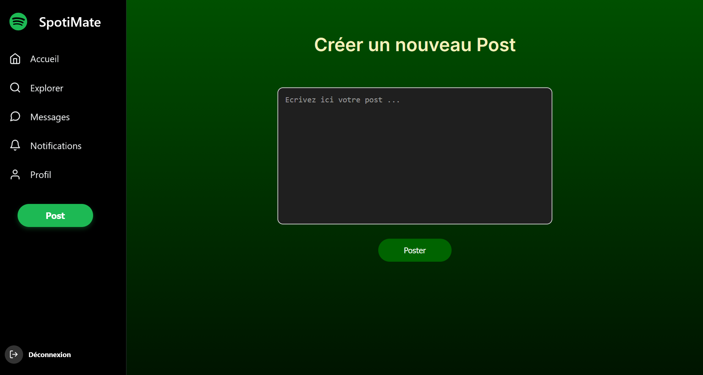

### Page Explorer (Profil, Artistes, Albums) :
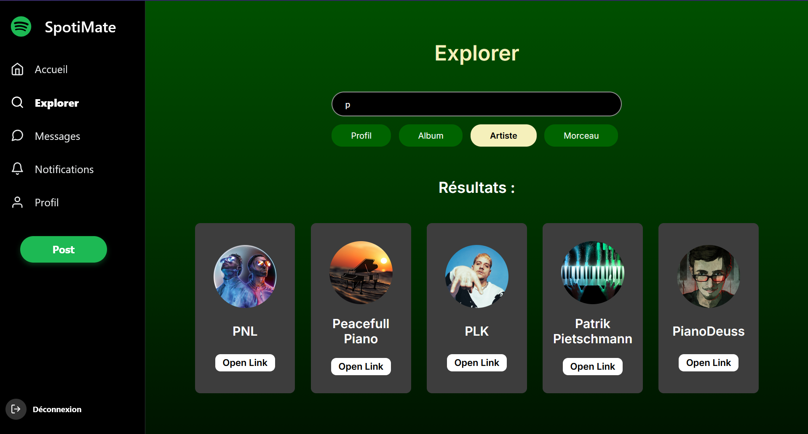
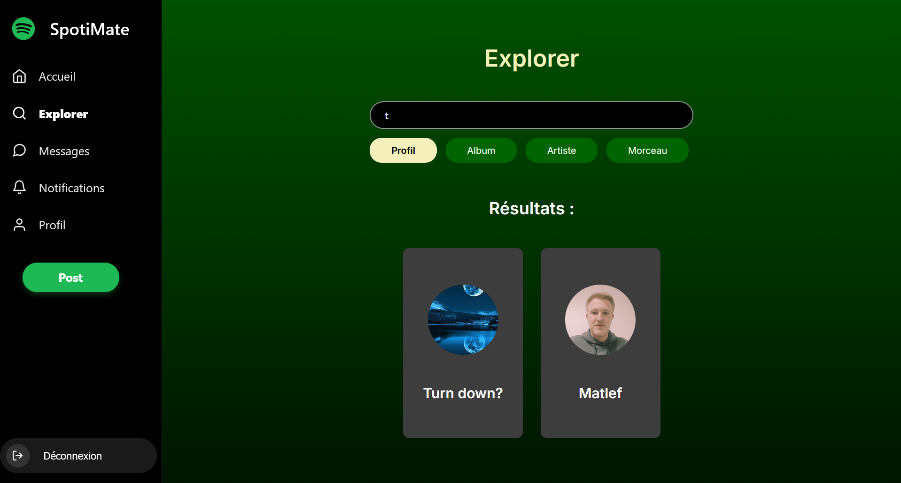

### Page Messagerie :
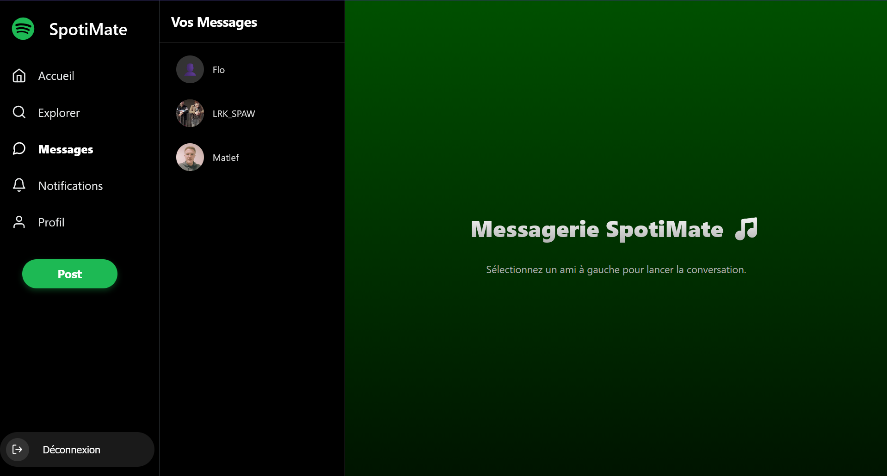
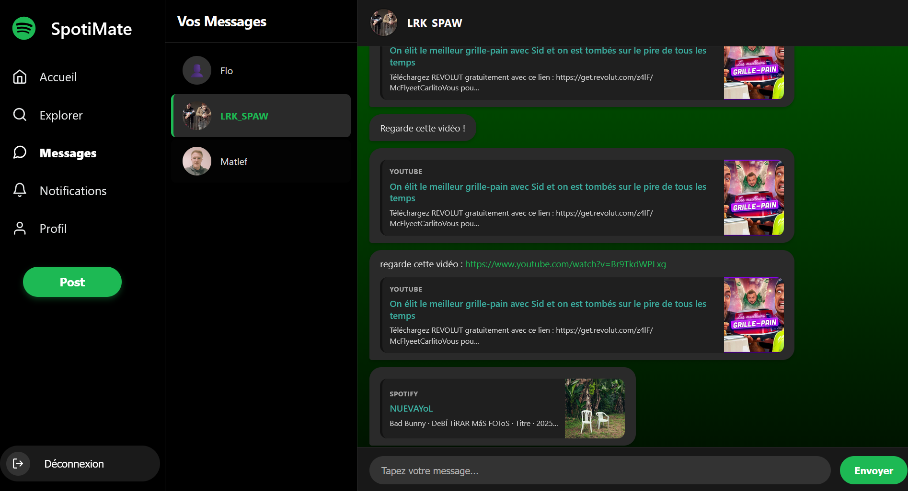

### Base de données MongoDB :
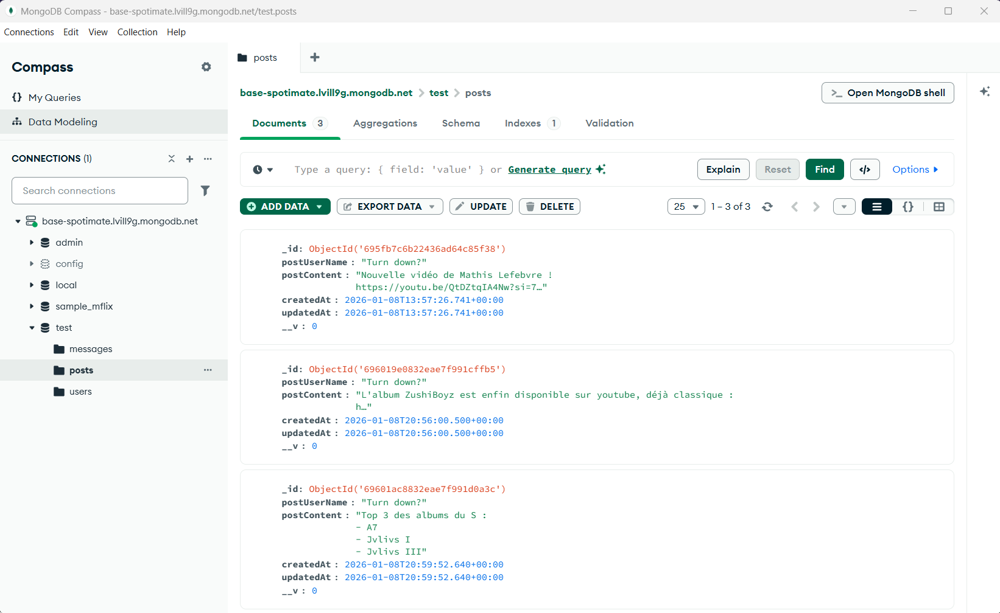

### Architecture du projet :
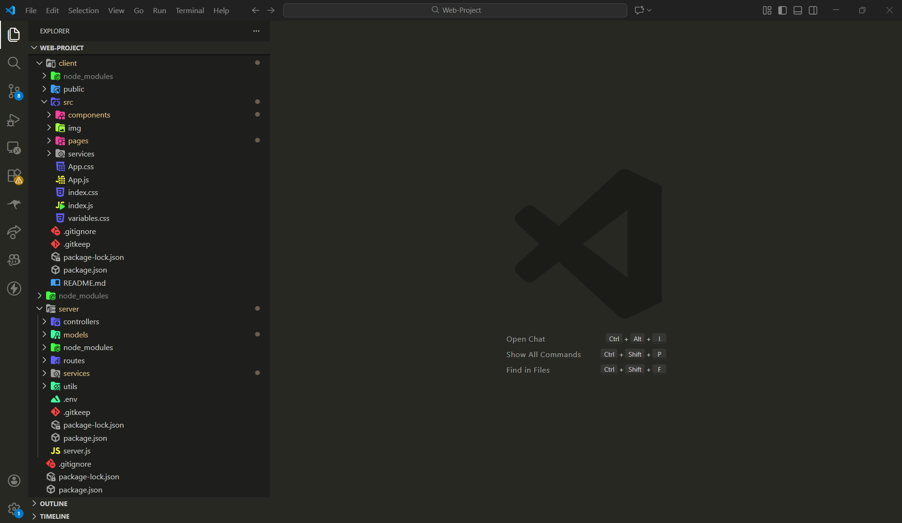

### License
[Polytech Angers](LICENSE) © Spotimate Team

### Contact
Pour toute question : spotimate@proton.me

    
# Projet Spotify Rencontres
